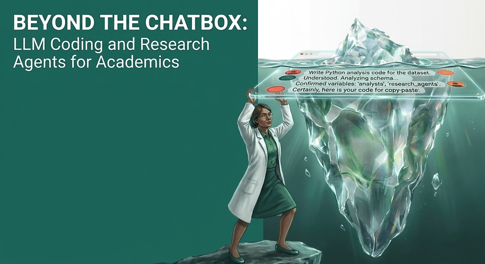

# Introduction {.unnumbered}

{.nolightbox}

## Overview

This interactive tutorial and workshop provides a practical introduction to using large language models (LLMs) in coding agents, featuring applied examples in population research. It is oragnized by [Egor Kotov](https://www.ekotov.pro) with support from the [Max Planck Institute for Demographic Research](https://www.demogr.mpg.de/en/).

## Workshop Details

- **Date:** June 03, 2026
- **Time:** 13:30-16:30
- **Location:** Complesso Belmeloro, room "Lab O", [Via Beniamino Andreatta, 8, 40126 Bologna BO, Italy](https://maps.app.goo.gl/dBrui9tWr6nRudbE7)

Abstract The software industry has been enjoying the benefits of coding agents for over a year now, with even top software engineers now having AI assistants generate a vast majority of their code. Now, the tools for agentic coding are mature enough for anyone to try.

Unlike many educational materials in this field, this workshop will also address the new vectors of attack that novice users might expose themselves to by using coding agents blindly. We will cover key security risks associated with agentic systems, including data leakage, unsafe code execution, and unintended modifications to analysis code and research materials. To mitigate these risks, we will introduce accessible strategies such as containerization, sandboxing, and workflow isolation.

Participants will also see how the agents themselves can assist in setting up and using these protective tools to improve transparency and reproducibility. The workshop will combine short demonstrations with applied examples relevant to population research. Participants are encouraged to bring their own projects or ideas, which we will use to explore how LLM agents can be integrated into real research workflows. For those without a project, guided exercises and example tasks will be provided.

You can find the original full announcement of the workshop at [MPIDR website](https://www.demogr.mpg.de/en/news_events_6123/calendar_1921/beyond_the_chatbox_llm_coding_and_research_agents_for_academics_15381).

## Before the Workshop: Accounts & Setup

To make the most of our hands-on sessions, please complete the following steps before the workshop on **June 3, 2026**.

::: {.callout-important}
### 🔒 Data Privacy & Security Warning
Free tiers for these LLM services typically **use your prompts and uploaded code for model training**. 
**Do not use these tools on private, sensitive, or proprietary research data!** Only use public or non-sensitive datasets during the workshop and for general testing.
:::

### Recommended Accounts to Register {#recommended-accounts}

Please sign up for the following services in advance to ensure you have enough free model usage quota during the exercises:

*   **Google Account** (A personal/secondary account is perfect) — Used for **Gemini CLI** and **Antigravity CLI**. No credit card is required.
*   **OpenCode Zen** ([opencode.ai/zen](https://opencode.ai/zen)) — Gives you free model access via the **OpenCode** agent. You can view the list of available models and details on [OpenCode Zen pricing/documentation](https://opencode.ai/docs/zen/#pricing).
*   **OpenRouter** ([openrouter.ai](https://openrouter.ai/)) — Allows accessing a wide variety of models. You'll need to generate a free [API Key](https://openrouter.ai/workspaces/default/keys) after registering, which can be used to access their catalog of [free models](https://openrouter.ai/models?order=pricing-low-to-high&q=free).
*   *Optional:* **NVIDIA NIM/Build** ([build.nvidia.com](https://build.nvidia.com/)) — Offers [free preview models](https://build.nvidia.com/models?filters=nimType%3Anim_type_preview) (note: account activation requires SMS verification via a mobile phone number).

::: {.callout-note}

If you have a subscription to another LLM service (such as OpenAI ChatGPT Plus, Claude Pro, Gemini Advanced, or Mistral) and prefer to use it during the workshop, please feel free to do so. However, our guided exercises will focus on the tools listed above to ensure everyone has access to the same models and features. 

The skills you will learn here are highly transferable to other AI coding assistants, though setup steps and specific features may vary by provider. Please refer to the documentation of your chosen agent for setup instructions, and don't hesitate to ask the agent itself how to configure it for your desired models and features.

:::

::: {.callout-warning}
### API & Account Safety Warning

Do **NOT** attempt to authenticate your Google or Anthropic (Claude) accounts directly within OpenCode. Their terms of service prohibit use of quota based subscriptions in third-party clients, and doing so can result in your accounts being permanently banned. OpenAI is currently a bit more flexible on this at the time of writing, but always verify provider policies.
:::

---

### Coding Agents We Will Use (and Why)

The coding agents are already pre-installed and configured inside the workshop's Docker container / Codespaces environment. We will focus on:

*   **Google Antigravity CLI** (and its predecessor **Gemini CLI**)
    *   *Why:* It provides a free daily quota to test cutting-edge models (like `Gemini 3.5 Flash`, `Gemini 3.1 Pro`, and `Claude` models) directly from your Google account.
*   **OpenCode CLI** 
    *   *Why:* A flexible, open-source-friendly agent that can connect to multiple backends. We will use it with free models from **OpenCode Zen**, **OpenRouter**, and **NVIDIA NIM** to show how easy it is to switch between different model providers without vendor lock-in.

::: {.callout-note}
What is `CLI`? It stands for "Command Line Interface" and means that you will interact with the agent by typing commands in a terminal (similar to your R console), rather than through a graphical user interface (GUI). This allows for more flexibility and control over the agent's behavior, as well as easier integration into coding workflows. This also gives you better insight into how the agent works under the hood, which is important for understanding its capabilities and limitations. You are of course free to use the same agents through their graphical interfaces too. We are also limited by the current tutorial environment and tools that are free to use. In our tutorial environment Gemini and Antigravity are only available as CLI, OpenCode is aslo CLI, but you will learn how to run it in graphical mode as well.
:::

---

To get started with the workshop materials, please navigate through the sections in the navigation bar on the left or with pagination links in the bottom.
